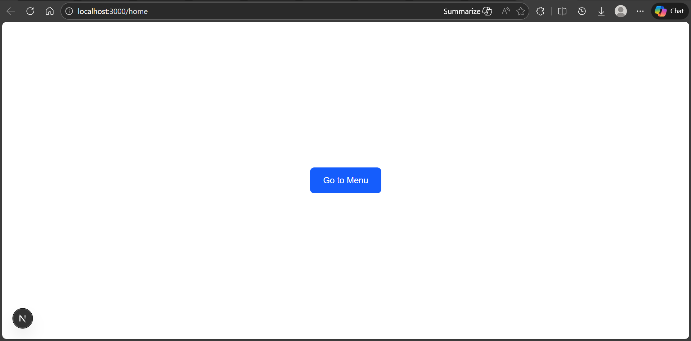
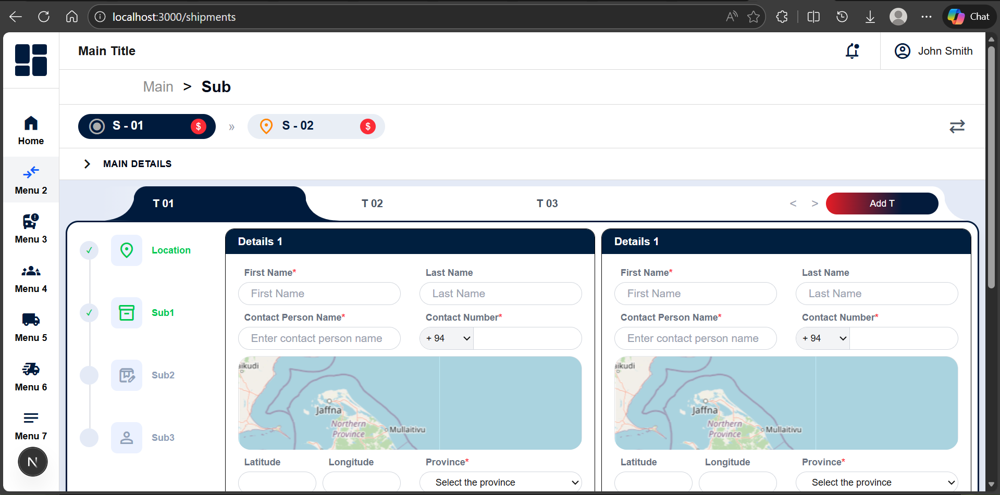

# 📦 Organia UI Task – Next.js Internship Assessment

## 📖 Project Overview

This project is a **UI-focused front-end implementation** developed as part of the **Next.js Internship Practical Assessment** for **Organia Innovations Labs**.

The goal of this task was to recreate the provided UI design using modern front-end development practices, focusing on:

- Clean and maintainable component structure
- Proper layout, spacing, and visual hierarchy
- Efficient form handling with validation
- Responsive design across multiple screen sizes

The implementation closely follows the reference design, although **minor visual differences from the reference may exist**.

---

## 🛠 Technology Stack

- **Framework:** Next.js
- **Styling:** Tailwind CSS
- **Form Handling:** React Hook Form
- **Validation:** Yup (schema-based validation)
- **State Management:** React Hooks
- **Maps:** Leaflet
- **Icons:** Google Material Symbols

---

## ✨ Form Functionality

- Forms are managed using **React Hook Form**
- Validation is implemented using **Yup** schemas
- Real-time validation feedback is provided for required fields

---

## 🗺 Map Integration

- Users can select a location by clicking on the map
- Selected location automatically updates:
  - **Latitude**
  - **Longitude**
- Coordinate values update in **real time** when the marker position changes

---

## 📱 Responsiveness

- Fully responsive UI supporting:
  - Desktop screens
  - Tablet screens
  - Mobile screens
- Sidebar collapses automatically on smaller screen sizes

---

## 🚀 Setup & Run Instructions

1. Clone the repository:

```bash
git clone https://github.com/Rasmilan1/organia-ui-task-rasmilan.git
cd organia-ui-task-rasmilan
```

npm install

npm run dev

Open in browser:http://localhost:3000

## 🖼 Screenshots

### Home



### Form Section




```


## 🗂 Directory Structure (src)


└── src/
    ├── app/
    │   ├── (general)/
    │   │   ├── dashboard/
    │   │   │   └── page.tsx
    │   │   ├── layout.tsx
    │   │   └── shipments/
    │   │       └── page.tsx
    │   ├── globals.css
    │   ├── home/
    │   │   ├── layout.tsx
    │   │   └── page.tsx
    │   ├── layout.tsx
    │   └── page.tsx
    ├── components/
    │   ├── CustomSelectField.tsx
    │   └── CustomTextField.tsx
    ├── features/
    │   ├── navigation/
    │   │   ├── components/
    │   │   │   ├── HamburgerModal.tsx
    │   │   │   ├── Sidebar.tsx
    │   │   │   └── TopNavbar.tsx
    │   │   └── helpers/

    │   └── shipments/
    │       ├── components/
    │       │   ├── DetailCard.tsx
    │       │   ├── DetailForm1.tsx
    │       │   ├── DetailForm2.tsx
    │       │   ├── LocationPicker.tsx
    │       │   ├── ProgressTracker.tsx
    │       │   ├── ShipmentForm.tsx
    │       │   ├── ShipmentPageHeader.tsx
    │       │   ├── SubDetailForm.tsx
    │       │   └── tabbar.tsx
    │       └── helpers/
    │           ├── FormHelpers.tsx
    │           └── ValidationSchema.tsx
    └── utils/
        └── Logo.tsx


```

# ⚠ Known Limitations

The UI may not be 100% pixel-identical to the provided design

